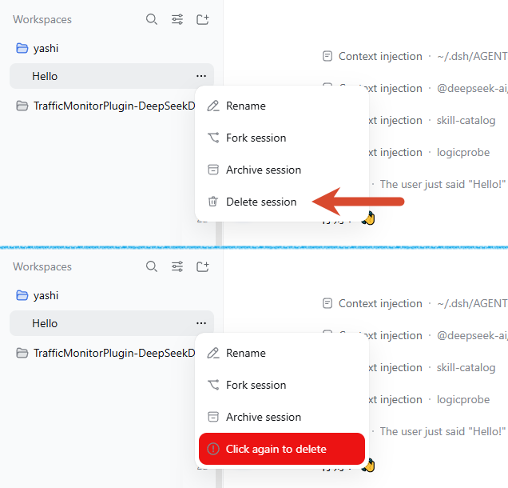

# dsh-delete-session

[简体中文](README.zh-CN.md) | 繁體中文 | [English](README.md) | [日本語](README.ja.md)


**快速徹底刪除會話的 DeepSeek Harness Web 外掛。**

外掛會在 DeepSeek Harness Web 左側會話清單中的會話行的 `…` 選單中，新增一項「刪除會話」。

使用預設的確認方式時：

1. 首次點選：就地變為警示狀態（紅底 + 警告圖示）。
2. 再次點選：永久刪除這條會話。

因此可以方便地透過雙擊刪除一個不需要的會話。

確認方式本身可以設定：外掛把本外掛的卡片註冊進官方 `plugins.bundle.config` 槽位，渲染在側欄「外掛」頁中本外掛的頁面上（開啟 `@kagurazakayashi/dsh-delete-session` 條目，設定區位於該外掛說明與各行之間），可以選擇「再次點選刪除」（預設）、「彈出對話方塊刪除」或「直接刪除（危險）」。儲存後的選擇立即生效，並持久化在 profile 的 `cordis.patch.yml` 中 `id: delete-session` 行的 `config:` 條目裡（例如 `$DSH_HOME/profiles/web/cordis.patch.yml`）。

它是一個極簡的 DeepSeek Harness Web 樹外（out-of-tree）外掛。它既不修改 DSH 核心安裝，也不改動任何核心檔案：host 行來自它自己的 `cordis.patch.yml` bundle patch，選單項則透過官方 `sidebar.workspaces.session.menu.item` 槽位貢獻，而不是以 DOM 注入的方式追加。

## 快速安裝

在終端執行以下兩條命令，即可完成安裝並啟動：

```bash
dsh plugin --profile web add @kagurazakayashi/dsh-delete-session
dsh web
```

重啟後重新整理頁面，開啟任意會話行的 `…` 選單，「歸檔會話」下方就會出現「刪除會話」。

## 功能特性

- host 端（`index.js`）註冊 `POST /delete-session/delete`。
- 瀏覽器端（`client.js`）把「刪除會話」項註冊進官方 `sidebar.workspaces.session.menu.item` 槽位（註冊 id `delete-session`，order `450`），因此緊跟在內建「歸檔會話」行（order `400`）之後（zh / en 雙語）。
- **三種確認方式，在外掛自己的頁面上選擇**（見[外掛設定](#外掛設定刪除確認方式)）：「再次點選刪除」（預設）走就地警示狀態，「彈出對話方塊刪除」彈出確認框，「直接刪除（危險）」首次點選即刪除、沒有任何確認。
- **預設的兩段式刪除，無確認彈窗**：第一次點選將選單項就地切換為警示狀態（紅底、警告圖示、文案「再次點選刪除」/「Click again to delete」），不關閉選單也不彈窗；第二次點選才真正呼叫刪除路由，成功後重新整理會話清單。
- 警示狀態按會話 id 記憶（記憶體態，8 秒自動解除），期間選單關閉再重開仍會以警示狀態顯示；刪除失敗也會解除警示。該狀態只在「再次點選刪除」模式下有意義。
- 「彈出對話方塊刪除」的確認框支援取消、Escape 與點選遮罩關閉，只有按下確認（危險色按鈕）才會刪除；初始焦點落在「取消」上以減少誤刪。
- 刪除失敗時彈出輕量錯誤提示（純 DOM，非確認框），說明失敗原因（會話使用中 / 不存在 / 網路錯誤等）。
- **正在執行任務的會話拒絕刪除**（HTTP 409）：只有 agent 狀態非 `idle`（正在執行任務）的會話才被拒絕，避免破壞正在寫入的日誌。僅被開啟過、之後切換走而仍駐留記憶體的空閒會話可以正常刪除。
- **設定卡片**：本外掛的卡片註冊進官方 `plugins.bundle.config` 槽位（以 npm 包名 `@kagurazakayashi/dsh-delete-session` 為鍵，由 `@deepseek-ai/dsh-client-ui-plugin-manager` 提供），渲染在側欄「外掛」頁中本外掛的頁面上，可選擇刪除確認方式（再次點選刪除 / 彈出對話方塊刪除 / 直接刪除（危險））。卡片採用「草稿 — 儲存」模型，儲存後寫入 profile 的 `cordis.patch.yml` 中 `id: delete-session` 行的 `config:` 條目；提供「已自定義」標記與「恢復預設」。已儲存的值立即決定下一次刪除的確認方式（卡片裡的草稿在按下「儲存」前不影響刪除行為）。

## 選單效果示意圖

點選會話行右側的 `…` 後，彈出的選單結構如下（`刪除會話` 由本外掛新增）。下圖為點選前與點選一次後的對比——第二次點選才會真正刪除：



```
會話行選單

├─ 重新命名會話      （核心自帶）
├─ 分叉會話        （核心自帶）
├─ 歸檔會話        （核心自帶）
└─ 刪除會話        ← 由本外掛新增（zh / en 雙語）
```

## 使用方式（刪除確認方式）

確認方式來自本外掛的設定卡片，預設為「再次點選刪除」。

**「再次點選刪除」**——兩段式確認，全程不彈窗：

```
第一次點選「刪除會話」
        │
        ▼
選單項就地變為紅底警示態「再次點選刪除」
        │
        ├─ 8 秒內未再點選 ──▶ 自動恢復為普通「刪除會話」
        │
        └─ 8 秒內再次點選 ──▶ 呼叫 POST /delete-session/delete
                                    │
                                    ├─ 會話正在執行任務 ──▶ 409 拒絕，彈錯誤提示
                                    │
                                    └─ 空閒會話 ──▶ 歸檔 → rm 會話目錄
                                                      │
                                                      ▼
                                                 200 OK，重新整理清單
```

**「彈出對話方塊刪除」**——選單關閉後彈出確認對話方塊，只有按下確認才會刪除：

```
點選「刪除會話」
        │
        ▼
確認對話方塊：確定要永久刪除會話「…」嗎？   [取消] [刪除]
        │
        ├─ 取消 / Escape / 點選遮罩 ──▶ 不執行任何刪除
        │
        └─ 刪除 ──▶ 呼叫 POST /delete-session/delete（後續校驗與上面相同）
```

**「直接刪除（危險）」**——首次點選立即刪除，沒有任何確認：

```
點選「刪除會話」──▶ 呼叫 POST /delete-session/delete（後續校驗與上面相同）
```

三種方式最終都走同一條刪除路徑，因此「執行中會話 409 拒絕」與「先歸檔再 rm」的行為完全一致。

## 外掛設定（刪除確認方式）

dsh 0.2.x 起，外掛設定**不再位於「設定」對話方塊**（那是 0.1.x 的位置），而在外掛自己的頁面上。按下面四步即可找到：

1. 在側欄頂部開啟「外掛」頁（四宮格圖示，位於「工作區」之上），不是底部的「設定」。
2. 等「已安裝」清單填充出來。該頁需要向 host 查詢外掛清單，冷啟動的瀏覽器會話裡可能要十幾秒；清單未出現時頁面幾乎是空的，並非沒有內容。
3. 在「已安裝」裡點本外掛的條目開啟詳情頁——`1.2.1` 起清單顯示本地化名稱「刪除會話」，舊版本顯示包名 `@kagurazakayashi/dsh-delete-session`；點右側開關或空白處不會進入詳情頁。
4. 設定區位於該外掛的**說明**與**包含的元件**之間；卡片預設收起，點卡片標題展開。

展開後可選刪除會話時的確認方式：

| 選項             | 含義                                                 |
| ---------------- | ---------------------------------------------------- |
| 再次點選刪除     | 首次點選進入警示狀態，再次點選才刪除（預設，最安全） |
| 彈出對話方塊刪除 | 點選後彈出確認對話方塊，確認後才刪除                 |
| 直接刪除（危險） | 點選後立即刪除，沒有任何二次確認                     |

儲存規則與核心的外掛設定卡片一致：

- 選擇只是草稿，按下「儲存」才會寫入；「放棄」丟棄草稿。
- 儲存成功後寫入 profile 的 `cordis.patch.yml` 中 `id: delete-session` 行的 `config`（設定名稱空間就是這個 profile 入口 id），重啟後仍然保留：
  ```yaml
  - id: delete-session
    config:
      confirmMode: click-again   # click-again | dialog | instant
  ```
- 欄位被使用者層覆寫時會顯示「已自定義」標記，可用「恢復預設」清除覆寫、重新繼承預設值。
- 儲存失敗（例如部署不允許寫入設定）時保留草稿並提示，不會靜默丟棄。

實現方式：設定名稱空間就是本 bundle 的 `cordis.patch.yml` 宣告的 profile 入口 id `delete-session`，host 端（`index.js`）以自己的 schemastery `Config` 宣告 schema（`confirmMode` 欄位，標記為 `.volatile()`），已不再有 `settings.installSection` / `settings.register` / `settings.get`。瀏覽器端透過 `ctx.configForms.get("delete-session")`（`getSnapshot` / `subscribe` / `set` / `unset`）讀寫該名稱空間，並把卡片註冊進官方 `plugins.bundle.config` 槽位，鍵為 npm 包名 `@kagurazakayashi/dsh-delete-session`（由 `@deepseek-ai/dsh-client-ui-plugin-manager` 提供）。settings 服務缺席的部署只會少一張卡片，刪除功能不受影響。

> 儲存後的值立即生效：它決定下一次點選「刪除會話」時的確認方式；卡片裡的草稿在按下「儲存」前不影響刪除行為。

> 找不到卡片時先確認兩件事：一是在「已安裝」組裡**點名稱**進詳情頁（不是點開關），二是清單可能還在載入。若啟用了帶背景圖案的皮膚，該頁文字會壓在畫面上、對比度偏低（外掛頁自身沒有不透明底色，卡片保留自己的底色），臨時切換或停用皮膚會更容易看清。

## 安裝

### 一鍵安裝（推薦）

```bash
dsh plugin --profile web add @kagurazakayashi/dsh-delete-session
```

此命令會從 npm 拉取外掛，並自動把它註冊到 profile 的 bundle 清單（無需手工編輯設定）。

### 從原始碼安裝

本外掛與 `dsh-archive-manager` 同構：放在磁碟上，再裝進現有 `web` profile。

1. 將外掛原始碼放到磁碟某處，例如 Windows 下：

   ```
   C:\Users\<你>\.dsh\plugins\dsh-delete-session
   ```

   （macOS / Linux 下為 `~/.dsh/plugins/dsh-delete-session`。）

2. 用 dsh 把它加入 `web` profile：

   ```bash
   # Windows（請替換 <你> 為你的使用者名稱）
   dsh plugin --profile web add "C:\Users\<你>\.dsh\plugins\dsh-delete-session"

   # macOS / Linux
   dsh plugin --profile web add "~/.dsh/plugins/dsh-delete-session"
   ```

3. 確認 `$DSH_HOME/profiles/web/package.json` 的 bundle 清單包含本外掛。較新版本的 dsh 會在 `add` 時自動追加；若沒有，手工補上：

   ```jsonc
   {
     "name": "dsh-profile-web",
     "private": true,
     "dependencies": {
       "@kagurazakayashi/dsh-delete-session": "link:../../plugins/dsh-delete-session"
     },
     "dsh": {
       "profile": {
         "bundles": [
           "@deepseek-ai/dsh-base",
           "@deepseek-ai/dsh-web-app",
           "@kagurazakayashi/dsh-delete-session"
         ]
       }
     }
   }
   ```

   `dependencies` 條目由 `dsh plugin --profile web add` 寫入；`dsh.profile.bundles` 若未自動追加則手工補上。

4. 外掛的 `cordis.patch.yml`（經 `dsh.bundle.patch` 宣告）注入 host 行：

   ```yaml
   - insert:
       - id: delete-session
         name: '@kagurazakayashi/dsh-delete-session'
   ```

## 重啟生效

執行中的程序不會載入新的 bundle 行，需要重啟 web profile：

```bash
dsh web
```

重新整理頁面後，開啟任意會話行 `…` 選單，符合條件的行會在「歸檔會話」下方出現「刪除會話」。預設（再次點選刪除）下點選一次進入警示狀態，再點一次即刪除；換成其它確認方式後，按對應的確認流程執行。

側欄「外掛」頁中本外掛頁面上的卡片同樣在重啟後出現（該頁面只顯示 host 端正在服務的名稱空間對應的條目）。

## 注意事項（安全與限制）

- **執行中會話拒絕刪除**：`ctx.agents.get(id)?.status !== 'idle'` 即返回 409，刪除前還會二次檢查。僅駐留記憶體的空閒（idle）會話不受此限制。
- **刪除前自動歸檔**：破壞性 `rm` 前先呼叫 `workspaceRegistry.archiveSession(id)`，讓側欄經 `host/archived-sessions-changed` 廣播即時隱藏該會話（同時讓「當前會話」被客戶端自動清空選擇），避免刪除後仍殘留在清單一直到重啟。歸檔是冪等的，失敗不阻斷刪除主流程。
- **會話定位策略**：核心已不再提供 `supportsRawArtifacts` 旗標。外掛先呼叫 JSONL 後端的公開 API `resolveCurrentLog(id)`（非同步返回當前格式世代日誌的絕對路徑）；它對尚未遷移、檔名不帶 `vN` 標記的舊格式會話會返回 `undefined`（本機 89 個既有會話中僅 4 個屬於新格式），此時回退到後端執行期仍提供的 `locate(header)`（返回 `{ kind, path }`）。兩者都不可用時返回 501。若後端丟擲帶 `kind: 'jsonl'` 與 `path` 診斷資訊的錯誤（例如日誌屬於更新版本），外掛會沿用該路徑完成刪除。
- **只刪會話目錄**：`rm(dirname(logPath), { recursive: true, force: false })`；刪除前會寫歸檔標記，但不修改工作區分組、投影快取與共享附件。刪除前還會校驗目標目錄名**正好等於會話 id**（後端以 `encodeSegment(id)` 命名，而會話 id 僅含 `[A-Za-z0-9._-]`），任何情況下都不會遞迴刪除到整個 project 目錄。
- **不可恢復**：刪除是遞迴 `rm`，沒有回收站，請謹慎操作。
- **兩段式確認的記憶體態**（僅「再次點選刪除」模式）：警示狀態只存在於瀏覽器記憶體（按會話 id，8 秒視窗），外掛解除安裝、頁面重新整理或超時後自動消失；不產生任何持久狀態。切換到其它確認方式後不再顯示該狀態。
- **官方會話選單槽位，無 DOM 注入**：本外掛向 `sidebar.workspaces.session.menu.item` 清單貢獻一個普通條目（註冊 id `delete-session`，order `450`），由宿主選單渲染為一個 `role="menuitem"` 按鈕。槽位直接提供 `{ sessionId, displayTitle }` 與 `useMenuOpenState` 鉤子，因此本外掛拿到的是精確的會話 id：既不捕捉會話行 `…` 按鈕的點選，也不執行 `document.body` 上的 `MutationObserver`、不解析會話行的 `aria-label`（`會話“{name}”的操作` / `Session actions for {name}`）、不重新實現核心的相對時間分桶，也不克隆「歸檔會話」項。鍵盤遍歷、焦點歸位與選單關閉都由宿主選單處理，因此不依賴任何 DOM 結構，也不依賴任何介面文案。
- **可用性跟隨槽位**：只要宿主渲染會話選單，該項就會出現；本外掛會等待該槽位被宣告，因此未組合 `@deepseek-ai/dsh-client-ui-workspace` 的部署不會留下任何痕跡。

## 版本相容性

本外掛適配的 DSH 版本與執行環境：

| 專案            | 版本 / 說明                                                                                                                                                                                                                      |
| --------------- | -------------------------------------------------------------------------------------------------------------------------------------------------------------------------------------------------------------------------------- |
| 適配的 DSH core | 最低 `0.2.0-rc.1`（所有 `@deepseek-ai/dsh*` peer 均為 `>=0.2.0-rc.1 <0.3.0-0`）；執行實測於 `0.2.0-rc.2`                                                                                                                         |
| 外掛版本        | `1.2.2`                                                                                                                                                                                                                          |
| 持久化後端      | `@deepseek-ai/dsh-session-persistence-jsonl`（須提供 `resolveCurrentLog` 或 `locate`）                                                                                                                                           |
| 設定服務        | `@deepseek-ai/dsh-settings`（host 端）與 `@deepseek-ai/dsh-client-ui-settings`（`ctx.configForms`）；可選：缺席時只是不顯示設定卡片                                                                                              |
| 客戶端注入依賴  | `@deepseek-ai/dsh-api-session-controller`、`@deepseek-ai/dsh-client-locale`、`@deepseek-ai/dsh-client-ui-plugin-manager`、`@deepseek-ai/dsh-client-ui-settings`、`@deepseek-ai/dsh-client-ui-workspace`                          |
| 貢獻的槽位      | `sidebar.workspaces.session.menu.item`（註冊 id `delete-session`，order `450`，由 `@deepseek-ai/dsh-client-ui-workspace` 宣告）；`plugins.bundle.config`（以 npm 包名為鍵，由 `@deepseek-ai/dsh-client-ui-plugin-manager` 宣告） |

自 `1.0.4` 起適配的 core 破壞性變更：

| core 變更      | 舊用法（≤ `1.0.3`）                     | 新用法（`1.0.4`）                                       |
| -------------- | ---------------------------------------- | ------------------------------------------------------- |
| 會話清單快照   | `list()` 項取頂層 `id`                   | `list()` 項取 `header.id`                               |
| 定位會話日誌   | `supportsRawArtifacts` 與 `locate(meta)` | 先 `resolveCurrentLog(id)`，舊格式回退 `locate(header)` |
| 工作區快照     | `workspaces.baselinesReady`              | 僅 `workspaces.phase === "ready"`                       |
| 工作區重新整理 | `workspaces.refresh()`                   | 該方法已移除；只重新整理 `sessions`                     |

自 `1.2.0` 起適配的 core 破壞性變更：

| core 變更             | 舊用法（≤ `1.1.0`）                                                                                              | 新用法（`1.2.0`）                                                                                                                                |
| --------------------- | ----------------------------------------------------------------------------------------------------------------- | ------------------------------------------------------------------------------------------------------------------------------------------------ |
| 設定名稱空間與 schema | host 端用 `ctx.settings.installSection` 註冊；名稱空間是一個設定節                                                | 名稱空間就是 profile 入口 id `delete-session`；host 端以自己的 schemastery `Config` 宣告 schema（`confirmMode`，標記 `.volatile()`）             |
| 讀寫設定值            | `ctx.settingsScope.bind({ namespace: 'delete-session' })`                                                         | `ctx.configForms.get("delete-session")`（`getSnapshot` / `subscribe` / `set` / `unset`）                                                         |
| 設定卡片槽位          | `settings.plugin.item`，鍵為名稱空間                                                                              | `plugins.bundle.config`，鍵為 npm 包名，由 `@deepseek-ai/dsh-client-ui-plugin-manager` 提供                                                      |
| 會話選單項            | DOM 注入：捕捉點選、`document.body` 上的 `MutationObserver`、解析 `aria-label`、相對時間分桶、克隆「歸檔會話」項  | `sidebar.workspaces.session.menu.item`，註冊 id `delete-session`，order `450`；槽位提供 `{ sessionId, displayTitle }` 與 `useMenuOpenState` 鉤子 |
| 設定持久化位置        | `$DSH_HOME/settings.yaml` 的 `delete-session:` 節                                                                 | profile 的 `cordis.patch.yml` 中 `id: delete-session` 行的 `config:` 條目                                                                        |
| 客戶端注入依賴        | `dsh-api-session-controller`、`dsh-api-workspace-controller`、`dsh-client-ui-settings`、`dsh-client-ui-workspace` | 移除不再使用的 `dsh-api-workspace-controller`，新增 `dsh-client-locale` 與 `dsh-client-ui-plugin-manager`                                        |

| 外掛版本 | 可用 core 版本               | 依據                                                                                                                                                                                                                                       |
| -------- | ---------------------------- | ------------------------------------------------------------------------------------------------------------------------------------------------------------------------------------------------------------------------------------------ |
| `1.2.2`  | `>= 0.2.0-rc.1 < 0.3.0-0`    | 官方 `@deepseek-ai/schemastery` 改為 `peerDependencies`，新增 `screenshots.json`（市場截圖清單），README 語言列與圖示改為原生 Markdown；功能與設定機制與 `1.2.1` 相同                                                                      |
| `1.2.1`  | `>= 0.2.0-rc.1 < 0.3.0-0`    | 新增外掛展示元資訊：`locale/{en,zh}.json` 提供本地化的外掛名與簡介，`icon.svg` 提供外掛頁圖示；設定機制與 `1.2.0` 相同                                                                                                                     |
| `1.2.0`  | `>= 0.2.0-rc.1 < 0.3.0-0`    | 讓外掛適配 dsh 0.2.x：設定名稱空間為 profile 入口 id `delete-session`，schema 由外掛自己的 schemastery `Config` 宣告，卡片經 `ctx.configForms` 讀寫，選單項與卡片都走官方槽位。不再支援 `0.1.x`，因為 0.1.x 的設定 API 已在 `0.2.0` 中移除 |
| `1.1.0`  | `>= 0.1.3-alpha.2 < 0.2.0-0` | 同 `1.0.4`；新增設定名稱空間 `delete-session`（刪除確認方式卡片），並讓三種確認方式（再次點選／對話方塊／直接刪除）真正生效。使用 0.1.x 的設定 API，因此無法在 `0.2.0` 及更高版本執行                                                      |
| `1.0.4`  | `>= 0.1.3-alpha.2 < 0.2.0-0` | `sessionPersistence.list()` 自該版本起返回 `SessionPersistenceSnapshot`（id 在 `header.id`）；`resolveCurrentLog()` 亦自該版本起可用                                                                                                       |
| `1.0.3`  | `<= 0.1.2-rc.1`              | 該區間 `list()` 返回 `SessionHeader[]`（id 在頂層），且 `locate()` / `supportsRawArtifacts` 仍是基類的公開 API                                                                                                                             |

各區間沒有重疊：`0.1.3-alpha.2` 同時改掉了 `list()` 的返回型別並移除了基類的 `locate()` / `supportsRawArtifacts`，因此不存在能同時執行 `1.0.3` 與 `1.0.4` 的 core 版本。`0.1.2-rc.1` 及更早版本無法使用 `1.0.4`；`1.2.0` 則要求 `0.2.x`：`1.1.0` 及更早版本無法在 `0.2.0` 及更高版本執行，因為 0.1.x 的設定 API（`settings.installSection` / `settingsScope` / `settings.plugin.item` 槽位）已在 `0.2.0` 中移除。

**從 `0.1.x` 遷移**：dsh `0.2.0` 只會為「匯入執行時組合中已存在的 profile 入口 id」匯入舊的 `$DSH_HOME/settings.yaml` 設定節，而這次匯入是一次性的、且已經執行完畢。因此，仍留在 `settings.yaml.imported` 裡的 `delete-session:` 節需要按[外掛設定](#外掛設定刪除確認方式)中的 YAML 片段手工搬進 profile 的 `cordis.patch.yml`。

## 解除安裝

從 profile 的 `dsh.profile.bundles`（以及 `dependencies`）中移除 `@kagurazakayashi/dsh-delete-session` 後重啟。外掛唯一的持久痕跡是 profile 的 `cordis.patch.yml` 中 `id: delete-session` 行的 `config:` 條目（只有在儲存過刪除確認方式後才會出現），需要一併清理時手動刪除該條目即可。

## License

MIT — 見 [LICENSE](LICENSE)，版權歸 KagurazakaYashi(KagurazakaMiyabi) 所有。
